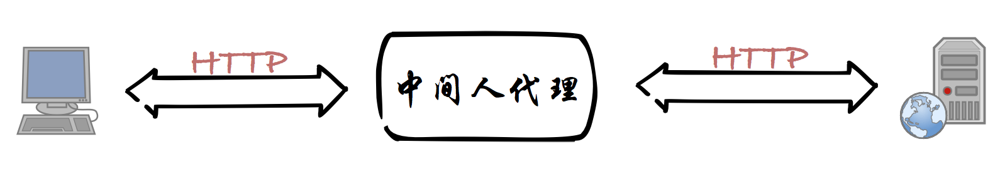
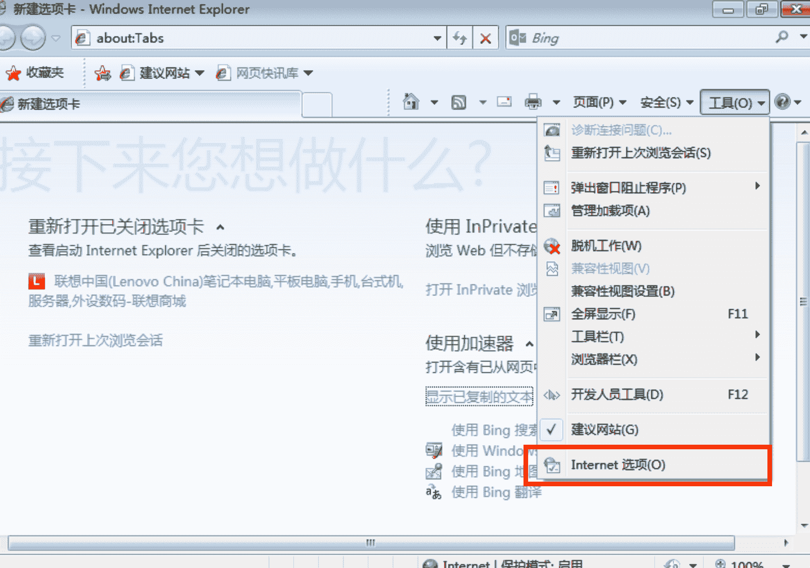
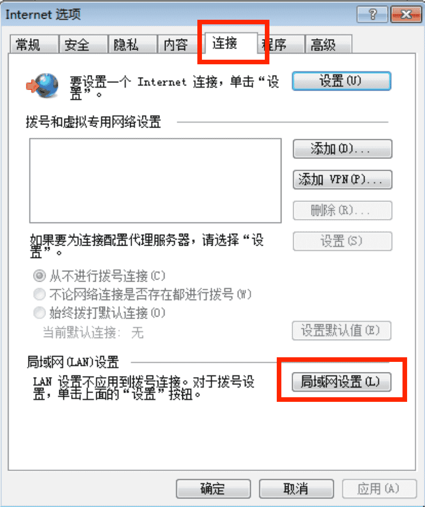
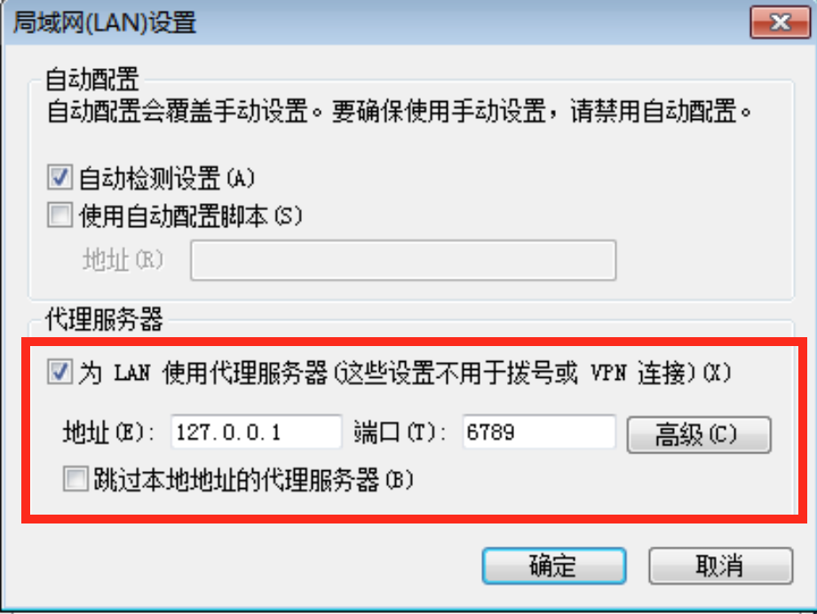
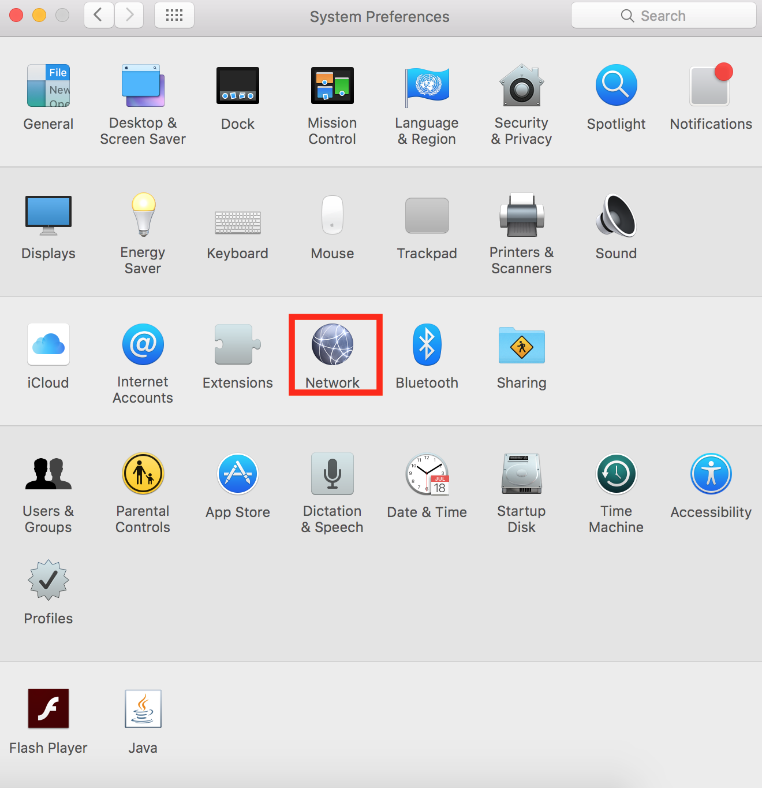
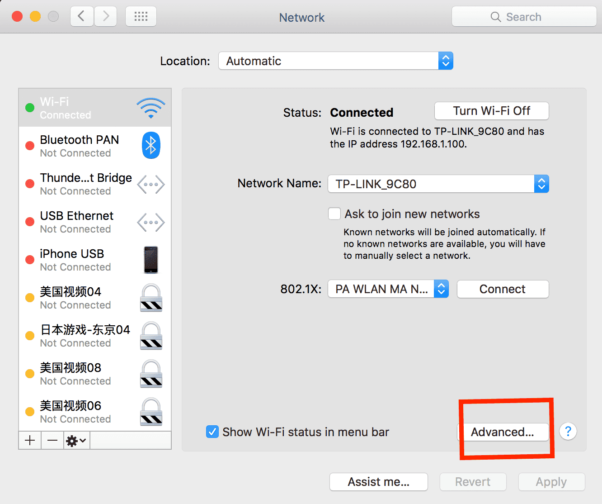
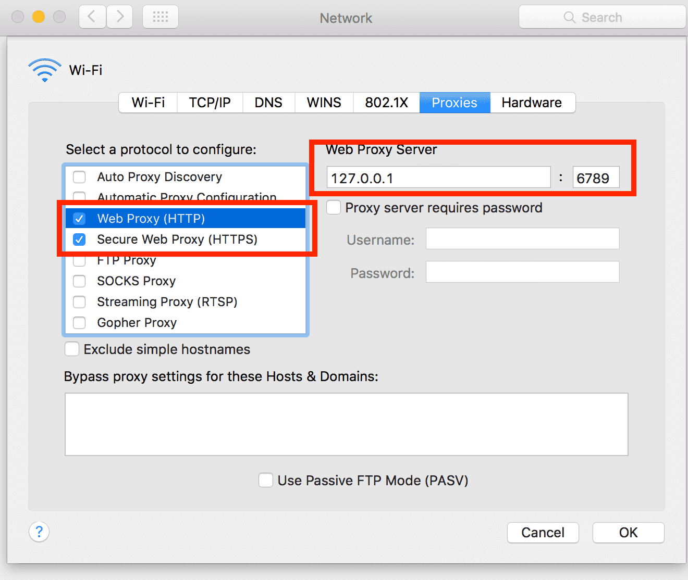
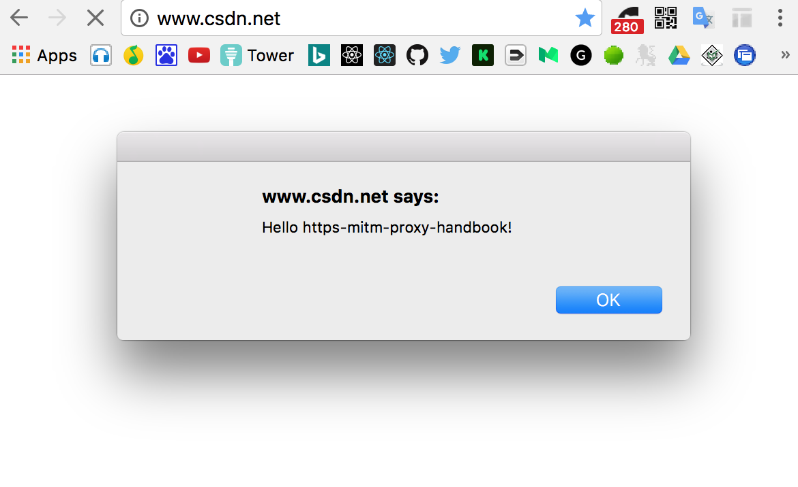

# 第1节：HTTP中间人代理实现

想实现HTTPS的中间人代理，我们先定个**小目标**，先实现一个**HTTP**的中间人代理。

HTTP中间人代理
-------
**HTTP中间人代理示意图：**  


由于HTTP的传输内容都是明文，想实现中间人代理就变得非常简单。  

部分代码实现如下：
```javascript
const http = require('http');
const url = require('url');

let httpMitmProxy = new http.Server();
// 启动端口
let port = 6789;

httpMitmProxy.listen(port, () => {
    console.log(`HTTP中间人代理启动成功，端口：${port}`);
});
// 代理接收客户端的转发请求
httpMitmProxy.on('request', (req, res) => {

    // 解析客户端请求
    var urlObject = url.parse(req.url);
    let options =  {
        protocol: 'http:',
        hostname: req.headers.host.split(':')[0],
        method: req.method,
        port: req.headers.host.split(':')[1] || 80,
        path: urlObject.path,
        headers: req.headers
    };

    console.log(`请求方式：${options.method}，请求地址：${options.protocol}//${options.hostname}:${options.port}${options.path}`);

    // 根据客户端请求，向真正的目标服务器发起请求。
    let realReq = http.request(options, (realRes) => {

        // 设置客户端响应的http头部
        Object.keys(realRes.headers).forEach(function(key) {
            res.setHeader(key, realRes.headers[key]);
        });

        // 设置客户端响应状态码
        res.writeHead(realRes.statusCode);

        // 通过pipe的方式把真正的服务器响应内容转发给客户端
        realRes.pipe(res);
    });

    // 通过pipe的方式把客户端请求内容转发给目标服务器
    req.pipe(realReq);

    realReq.on('error', (e) => {
        console.error(e);
    })
})
```
完整源码：[../code/chapter1/httpMitmProxy.js](../code/chapter1/httpMitmProxy.js)

npm script运行方式
```
npm run httpMitmProxy
```
上面的代码实现了一个最简单的http代理。  

流程概括如下：
- 1、接收客户端的转发请求。
- 2、根据客户端请求，向真正的目标服务器发起请求。
- 3、把客户端请求内容转发给目标服务器。
- 4、把真正的服务器响应内容转发给客户端。

设置代理
-------
代理服务启动好后，我们需要把本机上的http请求都通过代理做转发。

#### Windows 下设置代理方式

**第一步**：  

  

**第二步**：  

  

**第三步**：  

  

#### MAC 下设置代理方式

**第一步**：  

  

**第二步**：  

  

**第三步**：  

  


作为中间人，能做什么？
-------
通过该代理服务我们已经成功的与通信的两端（服务器和客户端）同时建立了连接。作为"中间人"，轻而易举就能篡改经过的请求和响应。

通过http代理修改html内容：
```javascript
const http = require('http');
const url = require('url');
const through = require('through2');

let httpMitmProxy = new http.Server();
// 启动端口
let port = 6789;

httpMitmProxy.listen(port, () => {
    console.log(`HTTP中间人代理启动成功，端口：${port}`);
});
// 代理接收客户端的转发请求
httpMitmProxy.on('request', (req, res) => {

    // 解析客户端请求
    var urlObject = url.parse(req.url);
    let options =  {
        protocol: 'http:',
        hostname: req.headers.host.split(':')[0],
        method: req.method,
        port: req.headers.host.split(':')[1] || 80,
        path: urlObject.path,
        headers: req.headers
    };

    // 为了方便起见，直接去掉客户端请求所支持的压缩方式
    delete options.headers['accept-encoding'];

    console.log(`请求方式：${options.method}，请求地址：${options.protocol}//${options.hostname}:${options.port}${options.path}`);

    // 根据客户端请求，向真正的目标服务器发起请求。
    let realReq = http.request(options, (realRes) => {

        // 设置客户端响应的http头部
        Object.keys(realRes.headers).forEach(function(key) {
            res.setHeader(key, realRes.headers[key]);
        });

        // 设置客户端响应状态码
        res.writeHead(realRes.statusCode);

        // 通过响应的http头部判断响应内容是否为html
        if (/html/i.test(realRes.headers['content-type'])) {
            realRes.pipe(through(function(chunk, enc, callback) {
                let chunkString = chunk.toString();
                // 给html注入的alert的js代码
                let script = '<script>alert("Hello https-mitm-proxy-handbook!")</script>'
                chunkString = chunkString.replace(/(<\/head>)/ig, function (match) {
                    return  script + match;
                });
                this.push(chunkString);
                callback();
            })).pipe(res);
        } else {
            realRes.pipe(res);
        }

    });

    // 通过pipe的方式把客户端请求内容转发给目标服务器
    req.pipe(realReq);

    realReq.on('error', (e) => {
        console.error(e);
    })
})
```
完整源码：[../code/chapter1/httpMitmProxyModifyRes.js](../code/chapter1/httpMitmProxyModifyRes.js)

npm script运行方式
```
npm run httpMitmProxyModifyRes
```
相比第一个代理只实现了单纯的转发，这一次的实现的代理对客户端请求和服务器响应都做了篡改。  

1、在处理客户端请求时，直接去掉了`accept-encoding`的http头部。  
2、修改了服务器响应内容，给所有html注入了一段alert的js代码`<script>alert("Hello https-mitm-proxy-handbook!")</script>`。为了方便的修改pipe流的内容，这里用到了[through2](https://github.com/rvagg/through2)。  

**现在通过代理来访问任何http的网站都会弹出alert框**



HTTP的安全问题
-------
从上面的http代理的实现可以看到，单纯的http协议是没有任何安全保障。想想平时身边的黑Wi-Fi、黑心运营商，想窥探或篡改通过http传输的内容是多么容易的一件事。

#### [第二节：如何代理HTTPS请求](./Chapter2.md)
