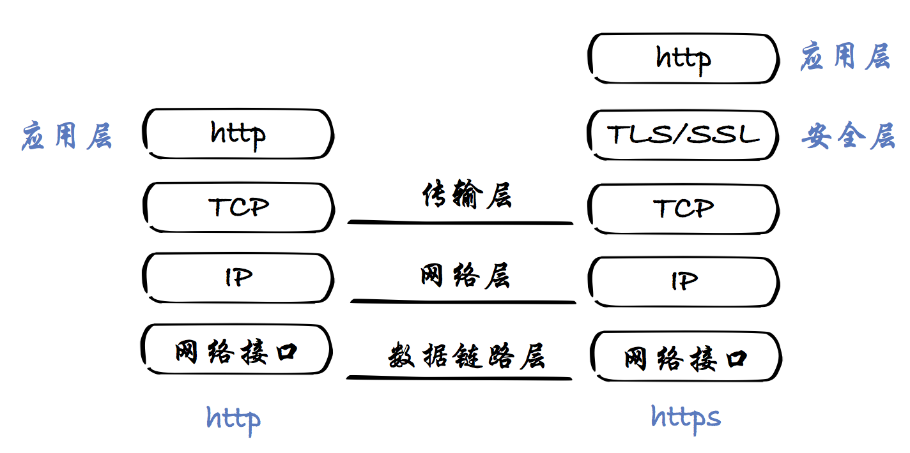
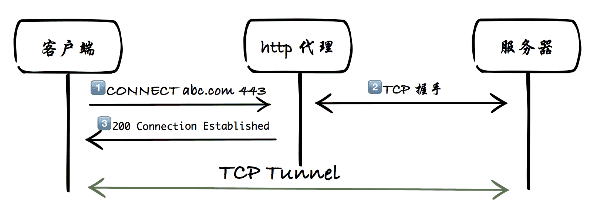

# 第二节：如何代理HTTPS请求

HTTP VS HTTPS
-------
回想上一节的http代理，我们是基于应用层的http协议实现的代理功能。由于http是明文传输，代理可以解析出客户端的真实的请求报文，并且拿着该请求报文“代表”客户端向真正的服务器发起请求。那么https是否仍然可以通过这样的方式进行代理？

先简单说下SSL/TLS，SSL/TLS协议是为了解决这三大风险而设计的<br>
>（1） 所有信息都是加密传播，第三方无法窃听。<br>
>（2） 具有校验机制，一旦被篡改，通信双方会立刻发现。<br>
>（3） 配备身份证书，防止身份被冒充。<br>  
(更多细节参考阮一峰的[《SSL/TLS协议运行机制的概述》](http://www.ruanyifeng.com/blog/2014/02/ssl_tls.html))

基于SSL/TLS设计的第**(1)**点，可知代理是无法像解析单纯的http协议那样解析https的报文，从而也无法像"代理"http那样“代理”https。在实际网络中，每个网络请求都会经过各种个样的网络节点，代理也是其中很常见的一种。https请求如何通过这些http代理节点连接到目标服务器？为了解决这类问题，http tunnel(隧道)技术就派上了用场。


# HTTP Tunnel(隧道)
**http和https关于分层的对比**  
  

从上图可以知道HTTPS的分层是在`传输层`之上建立了`安全层`，所有的HTTP请求都在`安全层`上传输。既然无法通过像代理一般HTTP请求的方式在`应用层`代理HTTPS请求，那么我们就退而求其次为在`传输层`为客户端和服务器建立起TCP连接。这种方式就像为客户端和服务器之间打通了一条**TCP连接的隧道**，作为HTTP代理对**隧道**里传输的内容一概不予理会，只负责传输。

#### HTTP Tunnel的建立过程
  

HTTP Tunnel的建立步骤  
> 第一步：客户端像http代理发起CONNECT请求。
```
CONNECT abc.com:443 HTTP/1.1
```

> 第二步：http代理接收到CONNECT请求后与abc.com的433端口建立tcp连接。

> 第三步：与abc.com的433端口建立tcp连接成功，通知客户端。
```
HTTP/1.1 200 Connection Established
```

这样一个http**隧道**就建立成功了。

#### 代码实现：
```javascript
/**
 *  HTTP Tunnel
 */
const http = require('http');
const url = require('url');
const net = require('net');

let httpTunnel = new http.Server();
// 启动端口
let port = 6789;

httpTunnel.listen(port, () => {
    console.log(`HTTP中间人代理启动成功，端口：${port}`);
});

httpTunnel.on('error', (e) => {
    if (e.code == 'EADDRINUSE') {
        console.error('HTTP中间人代理启动失败！！');
        console.error(`端口：${port}，已被占用。`);
    } else {
        console.error(e);
    }
});

// https的请求通过http隧道方式转发
httpTunnel.on('connect', (req, cltSocket, head) => {
  // connect to an origin server
  var srvUrl = url.parse(`http://${req.url}`);

  console.log(`CONNECT ${srvUrl.hostname}:${srvUrl.port}`);

  var srvSocket = net.connect(srvUrl.port, srvUrl.hostname, () => {
    cltSocket.write('HTTP/1.1 200 Connection Established\r\n' +
                    'Proxy-agent: MITM-proxy\r\n' +
                    '\r\n');
    srvSocket.write(head);
    srvSocket.pipe(cltSocket);
    cltSocket.pipe(srvSocket);
  });
  srvSocket.on('error', (e) => {
      console.error(e);
  });
});
```
完整源码：[../code/chapter2/httpTunnelHttps.js](../code/chapter2/httpTunnelHttps.js)

npm script运行方式
```
npm run httpTunnelHttps
```

设置完代理后，现在可以用浏览器尝试打开https的链接了。

#### [第三节：HTTPS数字证书和数字证书链](./Chapter3.md)
