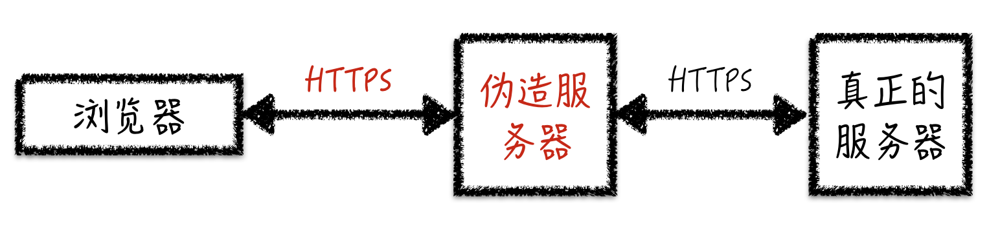

# 第2节：生成CA根证书

本章节涉及到的知识点：数字证书、数字证书链

## 思路

我们都知道HTTPS的传输的内容都是加密的，假设加密的算法是不能破解的，如何才能获取到原始的未加密传输内容呢？ 基本思路很简单，让客户端信任我们建立的服务。也就是信任我们提供的证书。如下图：



## 如何取得客户端的信任？

既然需要伪造服务器，怎么能让浏览器客户端相信伪造的服务是"真"的服务器。如果您已经了解HTTPS的数字证书和数字证书链，您可以直接跳过该段落。

首先说说HTTP**S**中的**S**代表什么?<br>
HTTP协议是互联网应用最广泛的一种网络协议，传输的内容是以明文方式进行。HTTP本身是没有任何安全保障，HTTPS的主要思想就是在不安全的网络上创建一安全信道，这里的**S**是指：SSL/TLS就是这一层安全的通道。

SSL/TLS协议是为了解决这三大风险而设计的<br>
（1） 所有信息都是加密传播，第三方无法窃听。<br>
（2） 具有校验机制，一旦被篡改，通信双方会立刻发现。<br>
（3） 配备身份证书，防止身份被冒充。<br>
(更多细节参考阮一峰的[《SSL/TLS协议运行机制的概述》](http://www.ruanyifeng.com/blog/2014/02/ssl_tls.html))

根据我们开始的思路，我们要需要解决的是上述SSL/TLS协议设计的第三点。也就是身份冒充----伪造一个让客户端信任的服务器。 HTTPS的信任体系即证书链，依赖于CA（certificate authority，数字证书认证机构）的认证。既然我们是伪造的服务器那我们就伪造一个CA的数字证书认机构。<br>
（数字证书和证书链的原理参考阮一峰的[数字签名是什么？](http://www.ruanyifeng.com/blog/2011/08/what_is_a_digital_signature.html)

## 生成CA根证书

源码：[example/createCertByRootCA.js](../example/createCertByRootCA.js)

运行方式：

```
npm run step1
```

如果你的项目已正常安装，这时候你的项目会多出一个文件夹`example/rootCA`，里面有两个生成的文件<br>
`rootCA.crt`是CA根证书<br>
`rootCA.key.pem`是CA根证书的密钥

在生成CA根证书的代码里我们用到了一个生成数字证书的Node.js库[forge](https://github.com/digitalbazaar/forge)。但注意的是，使用什么样的方式生成CA根证书并不影响我们最终实现一个HTTPS中间人代理，如果你对openssl生成证书的方式比较熟悉，用openssl完成这一步也是可行的。
