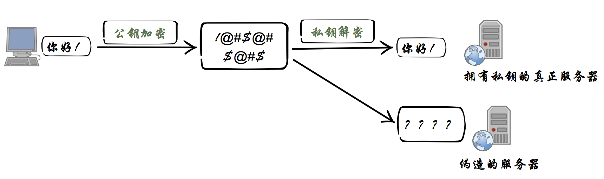
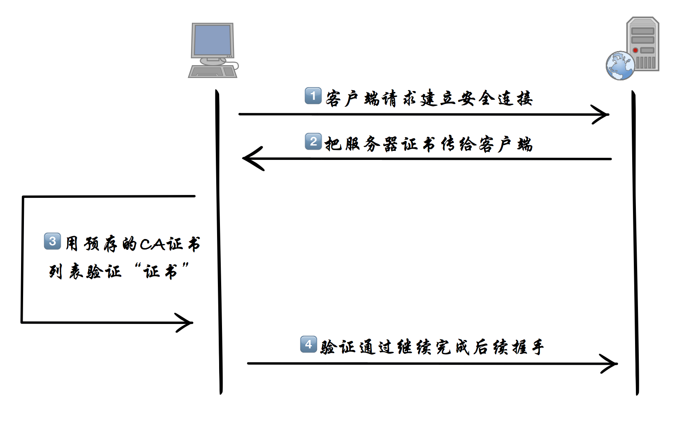

# 第三节：HTTPS数字证书和数字证书链

## 什么是数字证书和数字证书链
上一节说到SSL/TLS协议是为了解决三大风险而设计，第三点就是防止身份被冒充，防止身份被冒充的核心关键就是数字证书和数字证书链。下面我就用“大白话”简单说下数字证书和数字证书链。  

为了保证信息在传输中的安全和双方的身份不被冒充，HTTPS在建立安全链接阶段使用了公钥、私钥两把“钥匙”——**非对称加密**。非对称意思是：公钥加密的内容，只有私钥才能解密。私钥加密的内容，只有公钥才能解密。公钥是公开的，私钥保存在服务器端。

  

由上图可看出只有拥有了“私钥”的服务器才能解密出“公钥”加密的对话内容。如果客户端获取到的公钥确实是由**真正**服务器生成的，那么就能确保了服务器的身份不是伪造的。现在问题来了，因为公私钥的生成算法是开源的，每个服务器都能提供并生成自己的一对公私钥，客户端如何确认拿到的公钥不是伪造的。  

这里引出了另外一个安全机制，就是数字证书链。证书链的核心是**证书中心**(certificate authority，简称CA)，合法CA的公钥是**预存**在操作系统和浏览器里的，只有通过了CA认证了的服务器公钥才被浏览器客户端认为是可信的公钥。认证的原理很简单，依然是公私钥原理。CA拿自己的私钥去给需要认证的服务器公钥签名，生成一个“数字证书”。数字证书是包含了CA的签名，服务器自身公钥等等信息的集合体。浏览器拿着CA的公钥去验证该签名。只有被CA公钥验证通过的证书才是可信任的证书。有了这个逻辑，整个安全证书链信任系统就构成了。

**客户端验证服务器证书**  
  

## 如何取得“信任”
回到最初的思路分析：**建立一个可以同时与客户端和服务端进行通信的网络服务。**

现在需要解决的是如何得到客户端的信任，才能建立与客户端的通信。经过上面的分析，突破口就是CA证书。只要自定义的CA证书得到了客户端的信任，我就能用CA证书签发各种“伪造”的服务器证书。简单说就是让客户端系统安装上我们自定义的CA证书。

## 如何生成CA根证书
由于生成证书的方法是开源的，这里用到的是一个Node.js的库[forge](https://github.com/digitalbazaar/forge)。但需要注意的是，使用什么样的方式生成CA根证书并不影响我们最终实现一个HTTPS中间人代理，如果你对openssl生成证书的方式比较熟悉，用openssl完成这一步也是可行的。

**生产CA证书代码核心部分：**
```javascript
const forge = require('node-forge');
const pki = forge.pki;
const fs = require('fs');
const path = require('path');
const mkdirp = require('mkdirp');

var keys = pki.rsa.generateKeyPair(1024);
var cert = pki.createCertificate();
cert.publicKey = keys.publicKey;
cert.serialNumber = (new Date()).getTime() + '';

// 设置CA证书有效期
cert.validity.notBefore = new Date();
cert.validity.notBefore.setFullYear(cert.validity.notBefore.getFullYear() - 5);
cert.validity.notAfter = new Date();
cert.validity.notAfter.setFullYear(cert.validity.notAfter.getFullYear() + 20);
var attrs = [{
    name: 'commonName',
    value: 'https-mitm-proxy-handbook'
}, {
    name: 'countryName',
    value: 'CN'
}, {
    shortName: 'ST',
    value: 'GuangDong'
}, {
    name: 'localityName',
    value: 'ShenZhen'
}, {
    name: 'organizationName',
    value: 'https-mitm-proxy-handbook'
}, {
    shortName: 'OU',
    value: 'https://github.com/wuchangming/https-mitm-proxy-handbook'
}];
cert.setSubject(attrs);
cert.setIssuer(attrs);
cert.setExtensions([{
    name: 'basicConstraints',
    critical: true,
    cA: true
}, {
    name: 'keyUsage',
    critical: true,
    keyCertSign: true
}, {
    name: 'subjectKeyIdentifier'
}]);

// 用自己的私钥给CA根证书签名
cert.sign(keys.privateKey, forge.md.sha256.create());

var certPem = pki.certificateToPem(cert);
var keyPem = pki.privateKeyToPem(keys.privateKey);

console.log('公钥内容：\n');
console.log(certPem);
console.log('私钥内容：\n');
console.log(keyPem);
```

完整源码：[../code/chapter3/createRootCA.js](../code/chapter3/createRootCA.js)

npm script运行方式
```
npm run createRootCA
```

执行完`npm run createRootCA`后，CA根证书的`公私钥`会生成到项目根路径的`rootCA文件夹`下：  
> 公钥文件：rootCA/rootCA.crt  
> 私钥文件：rootCA/rootCA.key.pem
