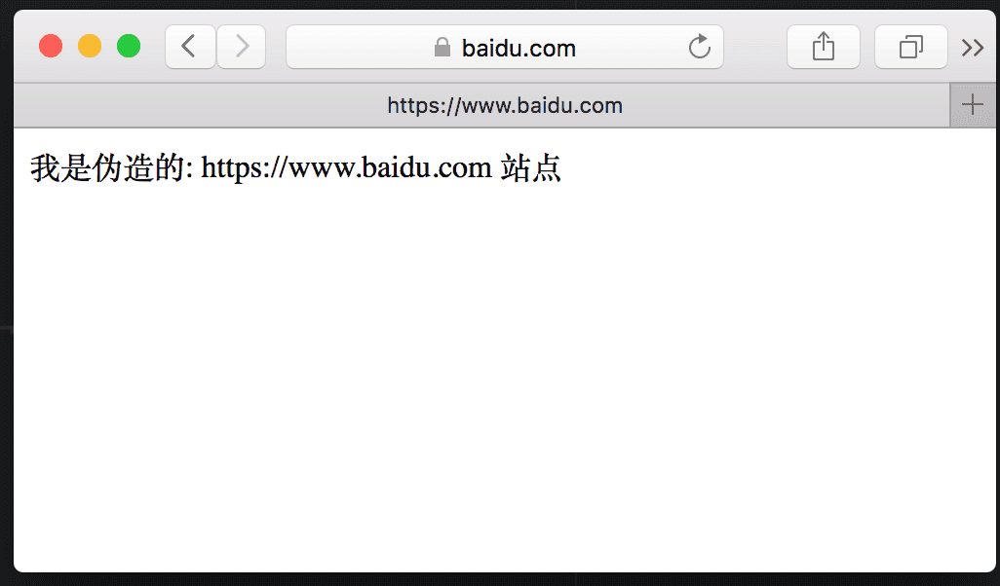

# 第四节：一个简易的HTTPS代理
结合前3节的内容，下面实现一个简易的HTTPS代理。  

在第二节了解了一个HTTPS请求的代理过程，在建立链接的第一步是一个HTTP CONNECT请求，在这一步可以获得客户端请求目标网站的**域名**（这么说不是很准确，具体可看看[SNI](https://zh.wikipedia.org/zh-hans/%E6%9C%8D%E5%8A%A1%E5%99%A8%E5%90%8D%E7%A7%B0%E6%8C%87%E7%A4%BA)）。用预先安装好的CA证书和密钥，生成对应**域名**的子证书。这个过程其实就是一个HTTPS代理的核心步骤。
## 获取https所请求的域名
```javascript

const http = require('http');
const url = require('url');
const net = require('net');
const createFakeHttpsWebSite = require('./createFakeHttpsWebSite')

let httpTunnel = new http.Server();
// 启动端口
let port = 6789;

httpTunnel.listen(port, () => {
    console.log(`简易HTTPS中间人代理启动成功，端口：${port}`);
});

httpTunnel.on('error', (e) => {
    if (e.code == 'EADDRINUSE') {
        console.error('HTTP中间人代理启动失败！！');
        console.error(`端口：${port}，已被占用。`);
    } else {
        console.error(e);
    }
});

// https的请求通过http隧道方式转发
httpTunnel.on('connect', (req, cltSocket, head) => {
  // connect to an origin server
  var srvUrl = url.parse(`http://${req.url}`);

  console.log(`CONNECT ${srvUrl.hostname}:${srvUrl.port}`);

  // 根据域名生成对应的https服务
  createFakeHttpsWebSite(srvUrl.hostname, (port) => {
      var srvSocket = net.connect(port, '127.0.0.1', () => {

        cltSocket.write('HTTP/1.1 200 Connection Established\r\n' +
                        'Proxy-agent: MITM-proxy\r\n' +
                        '\r\n');
        srvSocket.write(head);
        srvSocket.pipe(cltSocket);
        cltSocket.pipe(srvSocket);
      });
      srvSocket.on('error', (e) => {
          console.error(e);
      });
  })
});

```

## 伪造一个https服务站点
```javascript
/**
 * 根据域名生成一个伪造的https服务
 * @param  {[type]} domain     [description]
 * @param  {[type]} successFun [description]
 * @return {[type]}            [description]
 */
function createFakeHttpsWebSite(domain, successFun) {

    const fakeCertObj = createFakeCertificateByDomain(caKey, caCert, domain)
    var fakeServer = new https.Server({
        key: fakeCertObj.key,
        cert: fakeCertObj.cert,
        SNICallback: (hostname, done) => {
            let certObj = createFakeCertificateByDomain(caKey, caCert, hostname)
            done(null, tls.createSecureContext({
                key: pki.privateKeyToPem(certObj.key),
                cert: pki.certificateToPem(certObj.cert)
            }))
        }
    });

    fakeServer.listen(0, () => {
        var address = fakeServer.address();
        successFun(address.port);
    });
    fakeServer.on('request', (req, res) => {

        // 解析客户端请求
        var urlObject = url.parse(req.url);
        let options =  {
            protocol: 'https:',
            hostname: req.headers.host.split(':')[0],
            method: req.method,
            port: req.headers.host.split(':')[1] || 80,
            path: urlObject.path,
            headers: req.headers
        };
        res.writeHead(200, { 'Content-Type': 'text/html;charset=utf-8'});
        res.write(`<html><body>我是伪造的: ${options.protocol}//${options.hostname} 站点</body></html>`)
        res.end();
    });
    fakeServer.on('error', (e) => {
        console.error(e);
    });

}

/**
 * 根据所给域名生成对应证书
 * @param  {[type]} caKey  [description]
 * @param  {[type]} caCert [description]
 * @param  {[type]} domain [description]
 * @return {[type]}        [description]
 */
function createFakeCertificateByDomain(caKey, caCert, domain) {
    var keys = pki.rsa.generateKeyPair(2046);
    var cert = pki.createCertificate();
    cert.publicKey = keys.publicKey;

    cert.serialNumber = (new Date()).getTime()+'';
    cert.validity.notBefore = new Date();
    cert.validity.notBefore.setFullYear(cert.validity.notBefore.getFullYear() - 1);
    cert.validity.notAfter = new Date();
    cert.validity.notAfter.setFullYear(cert.validity.notAfter.getFullYear() + 1);
    var attrs = [{
      name: 'commonName',
      value: domain
    }, {
      name: 'countryName',
      value: 'CN'
    }, {
      shortName: 'ST',
      value: 'GuangDong'
    }, {
      name: 'localityName',
      value: 'ShengZhen'
    }, {
      name: 'organizationName',
      value: 'https-mitm-proxy-handbook'
    }, {
      shortName: 'OU',
      value: 'https://github.com/wuchangming/https-mitm-proxy-handbook'
    }];

    cert.setIssuer(caCert.subject.attributes);
    cert.setSubject(attrs);

    cert.setExtensions([{
        name: 'basicConstraints',
        critical: true,
        cA: false
    },
    {
        name: 'keyUsage',
        critical: true,
        digitalSignature: true,
        contentCommitment: true,
        keyEncipherment: true,
        dataEncipherment: true,
        keyAgreement: true,
        keyCertSign: true,
        cRLSign: true,
        encipherOnly: true,
        decipherOnly: true
    },
    {
        name: 'subjectAltName',
        altNames: [{
          type: 2,
          value: domain
        }]
    },
    {
        name: 'subjectKeyIdentifier'
    },
    {
        name: 'extKeyUsage',
        serverAuth: true,
        clientAuth: true,
        codeSigning: true,
        emailProtection: true,
        timeStamping: true
    },
    {
        name:'authorityKeyIdentifier'
    }]);
    cert.sign(caKey, forge.md.sha256.create());

    return {
        key: keys.privateKey,
        cert: cert
    };
}
```  

完整源码：[../code/chapter4](../code/chapter4)

npm script运行方式
```
npm run simpleHttpsProxy
```

这样一个简易的HTTPS代理就完成了。  
  
